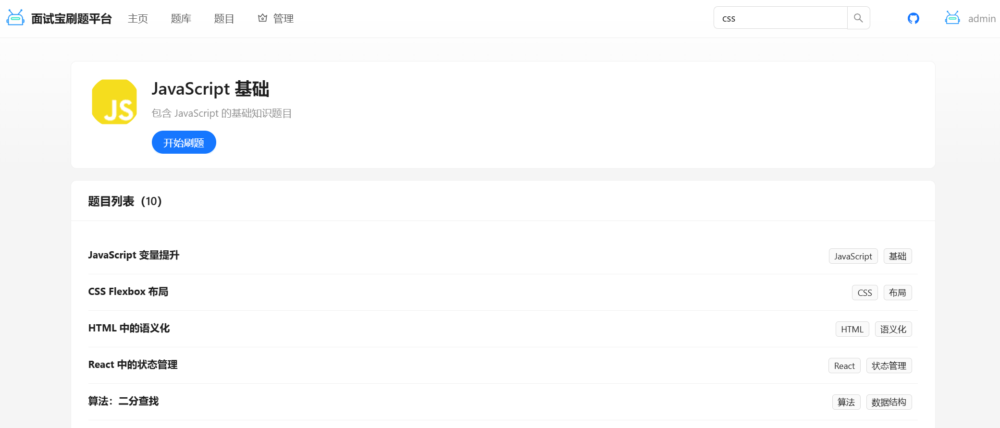

# 面试宝-面试刷题平台

## 项目介绍

基于 Next.js 服务端渲染 + Spring Boot + Redis + MySQL + Elasticsearch 的 面试刷题平台。

管理员可以创建题库、题目和题解，并批量关联题目到题库；用户可以注册登录、分词检索题目、在线刷题并查看刷题记录日历等。

使用数据库连接池、热 Key 探测、缓存、高级数据结构来提升性能。通过流量控制、熔断、动态 IP 黑白名单过滤、同端登录冲突检测、分级反爬虫策略来提升系统和内容的安全性。

>成品展示：[面试宝](http://113.45.26.143/)
>
>项目后端：[Seven11111/mianshibao-backend: 面试宝后端](https://github.com/Seven11111/mianshibao-backend)
>
>项目前端：[Seven11111/mianshibao-frontend: 面试宝前端](https://github.com/Seven11111/mianshibao-frontend)

## 项目展示

题目搜索页面：

题库详情页面：

题目管理页面，涉及批量操作和动态弹窗的开发：

本项目架构设计图：

## 技术选型

### 后端

- Java Spring Boot 框架 + Maven 多模块构建
- MySQL 数据库 + MyBatis-Plus 框架 + MyBatis X
- Redis 分布式缓存 + Caffeine 本地缓存
- Redission 分布式锁 + BitMap + BloomFilter
- ⭐️ Elasticsearch 搜索引擎
- ⭐️ Druid 数据库连接池 + 并发编程
- ⭐️ Sa-Token 权限控制
- ⭐️ HotKey 热点探测
- ⭐️ Sentinel 流量控制
- ⭐️ Nacos 配置中心
- ⭐️ 多角度项目优化：性能、安全性、可用性

### 前端

- React 18 框架
- ⭐️ Next.js 服务端渲染
- ⭐️ Redux 状态管理
- Ant Design 组件库
- 富文本编辑器组件
- ⭐️ 前端工程化：ESLint + Prettier + TypeScript
- ⭐️ OpenAPI 前端代码生成
